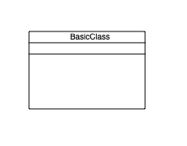
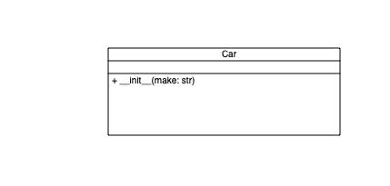
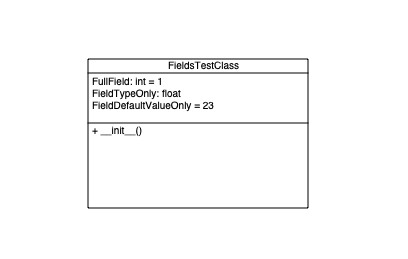

Usage
=====

.. _installation:

Installation
------------

To use pyumldiagrams, first install it using pip:

.. code-block:: console

   (.venv) $ pip install pyumldiagrams

===============
PDF Generation
===============

.. code-block:: console
    :caption:  Create a basic class diagram

    from pyumldiagrams.Definitions import ClassDefinition
    from pyumldiagrams.Definitions import Size

    from pyumldiagrams.pdf.PdfDiagram import PdfDiagram

    diagram: PdfDiagram = PdfDiagram(fileName='BasicClass.pdf', dpi=75)
    classDef: ClassDefinition = ClassDefinition(name='BasicClass', size=Size(width=150, height=100))

    diagram.drawClass(classDef)
    diagram.write()

Produces the following output

.. code-block:: console
    :caption: Create a class with a method

    from pyumldiagrams.Definitions import ClassDefinition
    from pyumldiagrams.Definitions import DefinitionType
    from pyumldiagrams.Definitions import MethodDefinition
    from pyumldiagrams.Definitions import ParameterDefinition
    from pyumldiagrams.Definitions import Position
    from pyumldiagrams.Definitions import Size

    from pyumldiagrams.pdf.PdfDiagram import PdfDiagram

    diagram:  PdfDiagram       = PdfDiagram(fileName=f'BasicMethod.pdf', dpi=75)
    position: Position         = Position(107, 30)
    size:     Size             = Size(width=266, height=100)
    car:       ClassDefinition = ClassDefinition(name='Car', position=position, size=size)

    initMethodDef: MethodDefinition   = MethodDefinition(name='__init__', visibility=DefinitionType.Public)
    initParam:    ParameterDefinition = ParameterDefinition(name='make', parameterType='str', defaultValue='')

    initMethodDef.parameters = [initParam]
    car.methods = [initMethodDef]

    diagram.drawClass(car)

    diagram.write()

Produces the following output

.. code-block:: console
    :caption: Create a class with fields

    from pyumldiagrams.BaseDiagram import BaseDiagram

    from pyumldiagrams.Definitions import ClassDefinition
    from pyumldiagrams.Definitions import DefinitionType
    from pyumldiagrams.Definitions import FieldDefinition
    from pyumldiagrams.Definitions import MethodDefinition
    from pyumldiagrams.Definitions import Position
    from pyumldiagrams.Definitions import Size

    from pyumldiagrams.pdf.PdfDiagram import PdfDiagram

    def buildFields() -> BaseDiagram.FieldsRepr:
        fields: BaseDiagram.FieldsRepr = []

        fieldFull:             FieldDefinition = FieldDefinition(name='FullField',             parameterType='int',   defaultValue='1')
        fieldTypeOnly:         FieldDefinition = FieldDefinition(name='FieldTypeOnly',         parameterType='float', defaultValue='')
        fieldDefaultValueOnly: FieldDefinition = FieldDefinition(name='FieldDefaultValueOnly', parameterType='',      defaultValue='23')

        fieldFull.visibility = DefinitionType.Public
        fieldTypeOnly.visibility = DefinitionType.Private
        fieldDefaultValueOnly.visibility = DefinitionType.Protected

        fields.append(fieldFull)
        fields.append(fieldTypeOnly)
        fields.append(fieldDefaultValueOnly)

        return fields

    fileName: str = f'BasicFields.pdf'
    diagram: PdfDiagram = PdfDiagram(fileName=fileName, dpi=75)

    fieldsTestClass: ClassDefinition = ClassDefinition(name='FieldsTestClass', position=Position(226, 102), size=Size(height=156, width=230))

    fieldsTestClass.fields = buildFields()

    initMethodDef: MethodDefinition = MethodDefinition(name='__init__', visibility=DefinitionType.Public)

    fieldsTestClass.methods = [initMethodDef]

    diagram.drawClass(classDefinition=fieldsTestClass)

    diagram.write()

Produces the following output

