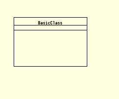

Basic Class
=================

.. code-block:: Python
    :caption:  Create a basic class diagram image
    :linenos:

    from pyumldiagrams.Definitions import ClassDefinition
    from pyumldiagrams.Definitions import Size

    from pyumldiagrams.image.ImageDiagram import ImageDiagram

    diagram:  ImageDiagram    = ImageDiagram(fileName='BasicClass.png')
    classDef: ClassDefinition = ClassDefinition(name='BasicClass', size=Size(width=150, height=100))

    diagram.drawClass(classDef)
    diagram.write()

Produces the following image output

