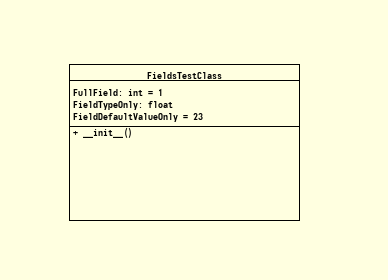

Basic Fields
============

.. code-block:: Python
    :caption: Create a class with fields
    :linenos:

    from pyumldiagrams.Definitions import ClassDefinition
    from pyumldiagrams.Definitions import DefinitionType
    from pyumldiagrams.Definitions import FieldDefinition
    from pyumldiagrams.Definitions import Fields
    from pyumldiagrams.Definitions import MethodDefinition
    from pyumldiagrams.Definitions import Methods
    from pyumldiagrams.Definitions import Position
    from pyumldiagrams.Definitions import Size

    from pyumldiagrams.image.ImageDiagram import ImageDiagram

    def buildFields() -> Fields:

        fields: Fields = Fields([])

        fieldFull:             FieldDefinition = FieldDefinition(name='FullField',             parameterType='int',   defaultValue='1')
        fieldTypeOnly:         FieldDefinition = FieldDefinition(name='FieldTypeOnly',         parameterType='float', defaultValue='')
        fieldDefaultValueOnly: FieldDefinition = FieldDefinition(name='FieldDefaultValueOnly', parameterType='',      defaultValue='23')

        fieldFull.visibility     = DefinitionType.Public
        fieldTypeOnly.visibility = DefinitionType.Private
        fieldDefaultValueOnly.visibility = DefinitionType.Protected

        fields.append(fieldFull)
        fields.append(fieldTypeOnly)
        fields.append(fieldDefaultValueOnly)

        return fields

    fileName:        str             = 'BasicFields.png'
    diagram:         ImageDiagram    = ImageDiagram(fileName=fileName)
    fieldsTestClass: ClassDefinition = ClassDefinition(name='FieldsTestClass', position=Position(226, 102), size=Size(height=156, width=230))

    fieldsTestClass.fields = buildFields()

    initMethodDef: MethodDefinition = MethodDefinition(name='__init__', visibility=DefinitionType.Public)

    fieldsTestClass.methods = Methods([initMethodDef])

    diagram.drawClass(classDefinition=fieldsTestClass)

    diagram.write()

Produces the following image output

