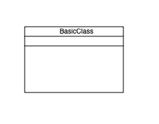

Basic Class
===========

.. code-block:: Python
    :caption:  Create a basic class diagram
    :linenos:

    from pyumldiagrams.Definitions import ClassDefinition
    from pyumldiagrams.Definitions import Size

    from pyumldiagrams.pdf.PdfDiagram import PdfDiagram

    diagram: PdfDiagram       = PdfDiagram(fileName='BasicClass.pdf', dpi=75)
    classDef: ClassDefinition = ClassDefinition(name='BasicClass', size=Size(width=150, height=100))

    diagram.drawClass(classDef)
    diagram.write()

Produces the following output

