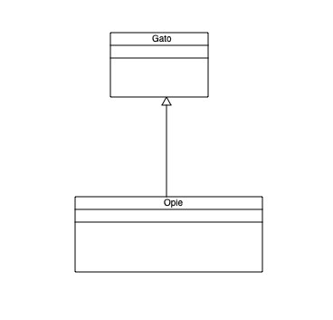

Inheritance
===========

.. code-block:: Python
    :caption: Create inheritance diagram
    :linenos:

    diagram: PdfDiagram = PdfDiagram(fileName='MinimalInheritance.pdf', dpi=75)

    cat:  ClassDefinition = ClassDefinition(name='Gato', position=Position(536, 19), size=Size(height=74, width=113))
    opie: ClassDefinition = ClassDefinition(name='Opie', position=Position(495, 208), size=Size(width=216, height=87))

    diagram.drawClass(classDefinition=cat)
    diagram.drawClass(classDefinition=opie)

    linePositions: LinePositions     = [Position(600, 208), Position(600, 93)]
    opieToCat:     UmlLineDefinition = UmlLineDefinition(lineType=LineType.Inheritance, linePositions=linePositions)

    diagram.drawUmlLine(lineDefinition=opieToCat)
    diagram.write()

Produces the following output

